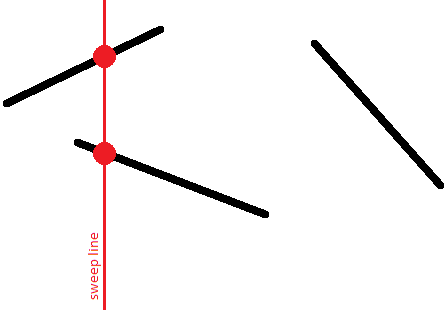
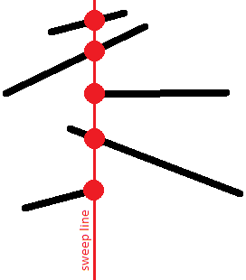
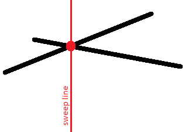

# Tìm kiếm một cặp đoạn thẳng giao nhau

---
tags:
  - Dịch
e_maxx_link: intersecting_segments
---

# Tìm kiếm một cặp đoạn thẳng giao nhau

Cho $n$ đoạn thẳng trên mặt phẳng. Yêu cầu kiểm tra xem có ít nhất hai trong số chúng giao nhau hay không.
Nếu câu trả lời là có, hãy in ra cặp đoạn thẳng giao nhau này; nó đủ để chọn bất kỳ cặp nào trong số nhiều câu trả lời.

Thuật toán giải pháp ngây thơ là lặp lại tất cả các cặp đoạn thẳng trong $O(n^2)$ và kiểm tra xem mỗi cặp có giao nhau hay không. Bài viết này mô tả một thuật toán có thời gian chạy $O(n \log n)$, dựa trên **thuật toán quét đường** (sweep line algorithm).

## Thuật toán

Hãy tưởng tượng một đường thẳng đứng $x = -\infty$ và bắt đầu di chuyển đường thẳng này sang phải.
Trong quá trình di chuyển, đường thẳng này sẽ gặp các đoạn thẳng và mỗi khi một đoạn thẳng giao với đường thẳng của chúng ta, nó sẽ giao nhau tại chính xác một điểm (chúng ta sẽ giả sử rằng không có đoạn thẳng đứng).

<center></center>

Do đó, đối với mỗi đoạn thẳng, tại một số thời điểm, điểm của nó sẽ xuất hiện trên đường quét, sau đó với sự di chuyển của đường thẳng, điểm này sẽ di chuyển và cuối cùng, tại một số điểm, đoạn thẳng sẽ biến mất khỏi đường thẳng.

Chúng ta quan tâm đến **thứ tự tương đối của các đoạn thẳng** dọc theo chiều dọc.
Cụ thể, chúng ta sẽ lưu trữ một danh sách các đoạn thẳng cắt đường quét tại một thời điểm nhất định, trong đó các đoạn thẳng sẽ được sắp xếp theo tọa độ $y$ của chúng trên đường quét.

<center></center>

Thứ tự này rất thú vị vì các đoạn thẳng giao nhau sẽ có cùng tọa độ $y$ ít nhất tại một thời điểm:

<center></center>

Chúng ta đưa ra các phát biểu chính:

  - Để tìm một cặp giao nhau, chỉ cần xem xét **các đoạn thẳng liền kề** ở mỗi vị trí cố định của đường quét.
  - Chỉ cần xem xét đường quét không phải ở tất cả các vị trí thực có thể $(-\infty \ldots +\infty)$, mà **chỉ ở những vị trí khi các đoạn thẳng mới xuất hiện hoặc các đoạn thẳng cũ biến mất**. Nói cách khác, chỉ cần giới hạn bản thân ở các vị trí bằng với hoành độ của các điểm cuối của các đoạn thẳng.
  - Khi một đoạn thẳng mới xuất hiện, nó đủ để **chèn** nó vào vị trí mong muốn trong danh sách thu được cho đường quét trước đó. Chúng ta chỉ nên kiểm tra giao điểm của **đoạn thẳng đã thêm với các lân cận trực tiếp của nó trong danh sách ở trên và ở dưới**.
  - Nếu đoạn thẳng biến mất, chỉ cần **xóa** nó khỏi danh sách hiện tại. Sau đó, cần phải **kiểm tra giao điểm của các lân cận trên và dưới trong danh sách**.
  - Không tồn tại những thay đổi khác trong chuỗi các đoạn thẳng trong danh sách, ngoại trừ những thay đổi được mô tả. Không yêu cầu kiểm tra giao điểm nào khác.

Để hiểu sự thật của những phát biểu này, những nhận xét sau là đủ:

  - Hai đoạn thẳng rời rạc không bao giờ thay đổi **thứ tự tương đối** của chúng.<br>
    Trên thực tế, nếu một đoạn thẳng đầu tiên cao hơn đoạn thẳng kia, sau đó trở nên thấp hơn, thì giữa hai thời điểm này có giao điểm của hai đoạn thẳng này.
  - Hai đoạn thẳng không giao nhau cũng không thể có cùng tọa độ $y$.
  - Từ đó suy ra rằng tại thời điểm xuất hiện của đoạn thẳng, chúng ta có thể tìm thấy vị trí cho đoạn thẳng này trong hàng đợi và chúng ta sẽ không phải sắp xếp lại đoạn thẳng này trong hàng đợi nữa: **thứ tự của nó so với các đoạn thẳng khác trong hàng đợi sẽ không thay đổi**.
  - Hai đoạn thẳng giao nhau tại thời điểm giao điểm của chúng sẽ là lân cận của nhau trong hàng đợi.
  - Do đó, để tìm các cặp đoạn thẳng giao nhau, chỉ cần kiểm tra giao điểm của tất cả và chỉ những cặp đoạn thẳng mà trong một khoảng thời gian nào đó trong quá trình di chuyển của đường quét, ít nhất một lần là lân cận của nhau. <br>
    Dễ dàng nhận thấy rằng chỉ cần kiểm tra đoạn thẳng đã thêm với các lân cận trên và dưới của nó, cũng như khi xóa đoạn thẳng - các lân cận trên và dưới của nó (sẽ trở thành lân cận của nhau sau khi xóa).<br>
  - Cần lưu ý rằng ở một vị trí cố định của đường quét, chúng ta phải **thêm tất cả các đoạn thẳng** bắt đầu ở tọa độ x này trước, và chỉ **sau đó xóa tất cả các đoạn thẳng** kết thúc ở đây.<br>
    Như vậy, chúng ta không bỏ lỡ giao điểm của các đoạn thẳng trên đỉnh: tức là những trường hợp khi hai đoạn thẳng có chung một đỉnh.
  - Lưu ý rằng **các đoạn thẳng đứng** thực sự không ảnh hưởng đến tính đúng đắn của thuật toán.<br>
    Các đoạn thẳng này được phân biệt bởi thực tế là chúng xuất hiện và biến mất cùng một lúc. Tuy nhiên, do nhận xét trước đó, chúng ta biết rằng tất cả các đoạn thẳng sẽ được thêm vào hàng đợi trước, và chỉ sau đó chúng sẽ bị xóa. Do đó, nếu đoạn thẳng đứng giao với một số đoạn thẳng khác được mở tại thời điểm đó (bao gồm cả đoạn thẳng đứng), nó sẽ được phát hiện.<br>
    **Đặt các đoạn thẳng đứng ở đâu trong hàng đợi?** Rốt cuộc, một đoạn thẳng đứng không có một tọa độ $y$ cụ thể, nó kéo dài cho toàn bộ đoạn dọc theo tọa độ $y$. Tuy nhiên, dễ hiểu rằng bất kỳ tọa độ nào từ đoạn này đều có thể được coi là tọa độ $y$.

Do đó, toàn bộ thuật toán sẽ thực hiện không quá $2n$ lần kiểm tra trên giao điểm của một cặp đoạn thẳng và sẽ thực hiện $O(n)$ thao tác với hàng đợi các đoạn thẳng (thao tác $O(1)$ tại thời điểm xuất hiện và biến mất của mỗi đoạn thẳng).

Do đó, **hành vi tiệm cận cuối cùng của thuật toán** là $O(n \log n)$.

## Triển khai

Chúng tôi trình bày triển khai đầy đủ của thuật toán được mô tả:

```cpp
const double EPS = 1E-9;

struct pt {
    double x, y;
};

struct seg {
    pt p, q;
    int id;

    double get_y(double x) const {
        if (abs(p.x - q.x) < EPS)
            return p.y;
        return p.y + (q.y - p.y) * (x - p.x) / (q.x - p.x);
    }
};

bool intersect1d(double l1, double r1, double l2, double r2) {
    if (l1 > r1)
        swap(l1, r1);
    if (l2 > r2)
        swap(l2, r2);
    return max(l1, l2) <= min(r1, r2) + EPS;
}

int vec(const pt& a, const pt& b, const pt& c) {
    double s = (b.x - a.x) * (c.y - a.y) - (b.y - a.y) * (c.x - a.x);
    return abs(s) < EPS ? 0 : s > 0 ? +1 : -1;
}

bool intersect(const seg& a, const seg& b)
{
    return intersect1d(a.p.x, a.q.x, b.p.x, b.q.x) &&
           intersect1d(a.p.y, a.q.y, b.p.y, b.q.y) &&
           vec(a.p, a.q, b.p) * vec(a.p, a.q, b.q) <= 0 &&
           vec(b.p, b.q, a.p) * vec(b.p, b.q, a.q) <= 0;
}

bool operator<(const seg& a, const seg& b)
{
    double x = max(min(a.p.x, a.q.x), min(b.p.x, b.q.x));
    return a.get_y(x) < b.get_y(x) - EPS;
}

struct event {
    double x;
    int tp, id;

    event() {}
    event(double x, int tp, int id) : x(x), tp(tp), id(id) {}

    bool operator<(const event& e) const {
        if (abs(x - e.x) > EPS)
            return x < e.x;
        return tp > e.tp;
    }
};

set<seg> s;
vector<set<seg>::iterator> where;

set<seg>::iterator prev(set<seg>::iterator it) {
    return it == s.begin() ? s.end() : --it;
}

set<seg>::iterator next(set<seg>::iterator it) {
    return ++it;
}

pair<int, int> solve(const vector<seg>& a) {
    int n = (int)a.size();
    vector<event> e;
    for (int i = 0; i < n; ++i) {
        e.push_back(event(min(a[i].p.x, a[i].q.x), +1, i));
        e.push_back(event(max(a[i].p.x, a[i].q.x), -1, i));
    }
    sort(e.begin(), e.end());

    s.clear();
    where.resize(a.size());
    for (size_t i = 0; i < e.size(); ++i) {
        int id = e[i].id;
        if (e[i].tp == +1) {
            set<seg>::iterator nxt = s.lower_bound(a[id]), prv = prev(nxt);
            if (nxt != s.end() && intersect(*nxt, a[id]))
                return make_pair(nxt->id, id);
            if (prv != s.end() && intersect(*prv, a[id]))
                return make_pair(prv->id, id);
            where[id] = s.insert(nxt, a[id]);
        } else {
            set<seg>::iterator nxt = next(where[id]), prv = prev(where[id]);
            if (nxt != s.end() && prv != s.end() && intersect(*nxt, *prv))
                return make_pair(prv->id, nxt->id);
            s.erase(where[id]);
        }
    }

    return make_pair(-1, -1);
}
```

Hàm chính ở đây là `solve()`, trả về các đoạn thẳng giao nhau nếu tồn tại, hoặc $(-1, -1)$ nếu không có giao điểm.

Việc kiểm tra giao điểm của hai đoạn thẳng được thực hiện bởi hàm `intersect ()`, sử dụng **thuật toán dựa trên diện tích có hướng của tam giác**.

Hàng đợi của các đoạn thẳng là biến toàn cục `s`, một `set<event>`. Các trình vòng lặp chỉ định vị trí của mỗi đoạn thẳng trong hàng đợi (để thuận tiện cho việc xóa các đoạn thẳng khỏi hàng đợi) được lưu trữ trong mảng toàn cục `where`.

Hai hàm phụ trợ `prev()` và `next()` cũng được giới thiệu, trả về các trình vòng lặp đến các phần tử trước đó và tiếp theo (hoặc `end()`, nếu không tồn tại).

Hằng số `EPS` biểu thị sai số khi so sánh hai số thực (nó chủ yếu được sử dụng khi kiểm tra giao điểm của hai đoạn thẳng).

## Bài tập
 * [TIMUS 1469 No Smoking!](https://acm.timus.ru/problem.aspx?space=1&num=1469)

--- 

