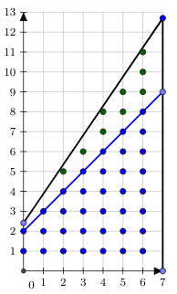
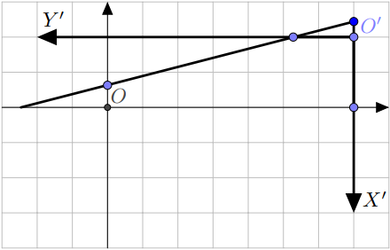

# Các điểm nguyên trong đa giác không nguyên

---
tags:
  - Bản gốc
---

# Các điểm nguyên trong đa giác không nguyên

Đối với đa giác nguyên, có công thức Pick để liệt kê các điểm nguyên bên trong đa giác.
Còn đối với đa giác có các đỉnh tùy ý thì sao?

Hãy xử lý từng cạnh của đa giác riêng lẻ, và sau đó chúng ta có thể cộng tổng số điểm nguyên bên dưới mỗi cạnh xem xét hướng của nó để chọn dấu (giống như trong việc tính diện tích của đa giác bằng hình thang).

Trước hết, chúng ta nên lưu ý rằng nếu cạnh hiện tại có điểm cuối là $A=(x_1;y_1)$ và $B=(x_2;y_2)$ thì nó có thể được biểu diễn dưới dạng hàm tuyến tính:

$$y=y_1+(y_2-y_1) \cdot \dfrac{x-x_1}{x_2-x_1}=\left(\dfrac{y_2-y_1}{x_2-x_1}\right)\cdot x + \left(\dfrac{y_1x_2-x_1y_2}{x_2-x_1}\right)$$

$$y = k \cdot x + b,~k = \dfrac{y_2-y_1}{x_2-x_1},~b = \dfrac{y_1x_2-x_1y_2}{x_2-x_1}$$

Bây giờ chúng ta sẽ thực hiện phép thay thế $x=x'+\lceil x_1 \rceil$ sao cho $b' = b + k \cdot \lceil x_1 \rceil$.
Điều này cho phép chúng ta làm việc với $x_1'=0$ và $x_2'=x_2 - \lceil x_1 \rceil$.
Ký hiệu $n = \lfloor x_2' \rfloor$.

Chúng ta sẽ không cộng các điểm tại $x = n$ và trên $y = 0$ để đảm bảo tính toàn vẹn của thuật toán.
Chúng có thể được thêm vào thủ công sau đó.
Do đó, chúng ta phải tính tổng $\sum\limits_{x'=0}^{n - 1} \lfloor k' \cdot x' + b'\rfloor$. Chúng ta cũng giả sử rằng $k' \geq 0$ và $b'\geq 0$.
Nếu không, người ta nên thay thế $x'=-t$ và cộng $\lceil|b'|\rceil$ vào $b'$.

Hãy thảo luận về cách chúng ta có thể đánh giá tổng $\sum\limits_{x=0}^{n - 1} \lfloor k \cdot x + b\rfloor$.
Chúng ta có hai trường hợp:

  - $k \geq 1$ hoặc $b \geq 1$.
  
    Sau đó, chúng ta nên bắt đầu bằng cách cộng các điểm bên dưới $y=\lfloor k \rfloor \cdot x + \lfloor b \rfloor$. Số lượng của chúng bằng

    \[ \sum\limits_{x=0}^{n - 1} \lfloor k \rfloor \cdot x + \lfloor b \rfloor=\dfrac{(\lfloor k \rfloor(n-1)+2\lfloor b \rfloor) n}{2}. \]
    
    Bây giờ chúng ta chỉ quan tâm đến các điểm $(x;y)$ sao cho $\lfloor k \rfloor \cdot x + \lfloor b \rfloor < y \leq k\cdot x + b$.
    Số lượng này giống như số lượng điểm sao cho $0 < y \leq (k - \lfloor k \rfloor) \cdot x + (b - \lfloor b \rfloor)$.
    Vì vậy, chúng ta đã rút gọn bài toán của mình thành $k'= k - \lfloor k \rfloor$, $b' = b - \lfloor b \rfloor$ và cả $k'$ và $b'$ đều nhỏ hơn $1$ bây giờ.
    Đây là một bức tranh, chúng ta chỉ cần cộng các điểm màu xanh lam và trừ hàm tuyến tính màu xanh lam khỏi hàm tuyến tính màu đen để rút gọn bài toán thành các giá trị nhỏ hơn cho $k$ và $b$:
    <center></center>

  - $k < 1$ và $b < 1$.

    Nếu $\lfloor k \cdot n + b\rfloor$ bằng $0$, chúng ta có thể trả về $0$ một cách an toàn.
    Nếu không phải như vậy, chúng ta có thể nói rằng không có điểm nguyên nào sao cho $x < 0$ và $0 < y \leq k \cdot x + b$.
    Điều đó có nghĩa là chúng ta sẽ có cùng một câu trả lời nếu chúng ta xem xét hệ quy chiếu mới trong đó $O'=(n;\lfloor k\cdot n + b\rfloor)$, trục $x'$ được hướng xuống và trục $y'$ được hướng sang trái.
    Đối với hệ quy chiếu này, chúng ta quan tâm đến các điểm nguyên trên tập hợp

    \[ \left\{(x;y)~\bigg|~0 \leq x < \lfloor k \cdot n + b\rfloor,~ 0 < y \leq \dfrac{x+(k\cdot n+b)-\lfloor k\cdot n + b \rfloor}{k}\right\} \]

    nó đưa chúng ta trở lại trường hợp $k>1$.
    Bạn có thể thấy điểm tham chiếu mới $O'$ và các trục $X'$ và $Y'$ trong hình bên dưới:
    <center></center>
    Như bạn thấy, trong hệ quy chiếu mới, hàm tuyến tính sẽ có hệ số $\tfrac 1 k$ và số 0 của nó sẽ nằm ở điểm $\lfloor k\cdot n + b \rfloor-(k\cdot n+b)$, điều này làm cho công thức trên chính xác.

## Phân tích độ phức tạp

Chúng ta phải đếm nhiều nhất $\dfrac{(k(n-1)+2b)n}{2}$ điểm.
Trong số đó, chúng ta sẽ đếm $\dfrac{\lfloor k \rfloor (n-1)+2\lfloor b \rfloor}{2}$ ở bước đầu tiên.
Chúng ta có thể coi $b$ là nhỏ không đáng kể vì chúng ta có thể bắt đầu bằng cách làm cho nó nhỏ hơn $1$.
Trong trường hợp đó, chúng ta có thể nói rằng chúng ta đếm khoảng $\dfrac{\lfloor k \rfloor}{k} \geq \dfrac 1 2$ tất cả các điểm.
Do đó, chúng ta sẽ kết thúc trong $O(\log n)$ bước.

## Triển khai

Đây là hàm đơn giản tính số điểm nguyên $(x;y)$ sao cho $0 \leq x < n$ và $0 < y \leq \lfloor k x+b\rfloor$:

```cpp
int count_lattices(Fraction k, Fraction b, long long n) {
    auto fk = k.floor();
    auto fb = b.floor();
    auto cnt = 0LL;
    if (k >= 1 || b >= 1) {
        cnt += (fk * (n - 1) + 2 * fb) * n / 2;
        k -= fk;
        b -= fb;
    }
    auto t = k * n + b;
    auto ft = t.floor();
    if (ft >= 1) {
        cnt += count_lattices(1 / k, (t - t.floor()) / k, t.floor());
    }
    return cnt;
}
```

Ở đây, `Fraction` là một số lớp xử lý số hữu tỉ.
Trên thực tế, có vẻ như nếu tất cả các mẫu số và tử số nhiều nhất là $C$ theo giá trị tuyệt đối thì trong các lệnh gọi đệ quy, chúng sẽ nhiều nhất là $C^2$ nếu bạn tiếp tục chia tử số và mẫu số cho ước chung lớn nhất của chúng.
Với giả định này, chúng ta có thể nói rằng người ta có thể sử dụng số thực và yêu cầu độ chính xác là $\varepsilon^2$ trong đó $\varepsilon$ là độ chính xác mà $k$ và $b$ được cho.
Điều đó có nghĩa là trong hàm floor, người ta nên coi các số là số nguyên nếu chúng khác nhau nhiều nhất $\varepsilon^2$ so với số nguyên.


--- 
