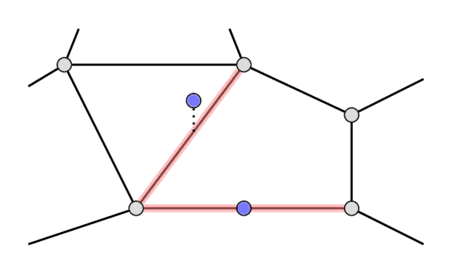
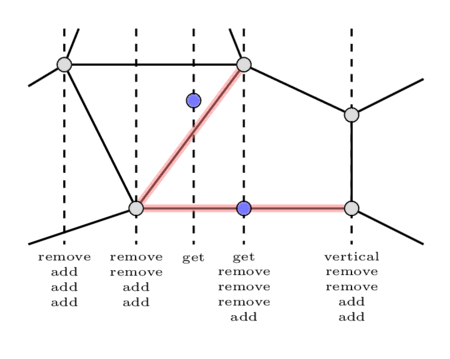

# Định vị điểm trong $O(log n)$

---
tags:
  - Bản gốc
---

# Định vị điểm trong $O(log n)$

Xét bài toán sau: bạn được cung cấp một [phân vùng mặt phẳng](https://en.wikipedia.org/wiki/Planar_straight-line_graph) mà không có đỉnh nào có bậc một và 0, và rất nhiều truy vấn.
Mỗi truy vấn là một điểm, mà chúng ta nên xác định mặt của phân vùng mà nó thuộc về.
Chúng ta sẽ trả lời mỗi truy vấn trong $O(\log n)$ ngoại tuyến (offline).<br>
Bài toán này có thể phát sinh khi bạn cần định vị một số điểm trong sơ đồ Voronoi hoặc trong một số đa giác đơn giản.

## Thuật toán

Đầu tiên, đối với mỗi điểm truy vấn $p\ (x_0, y_0)$, chúng ta muốn tìm một cạnh sao cho nếu điểm đó thuộc về bất kỳ cạnh nào, thì điểm đó nằm trên cạnh mà chúng ta đã tìm thấy, nếu không thì cạnh này phải cắt đường thẳng $x = x_0$ tại một số điểm duy nhất $(x_0, y)$ trong đó $y < y_0$ và $y$ này là lớn nhất trong số tất cả các cạnh như vậy.
Hình ảnh sau đây cho thấy cả hai trường hợp.

<center></center>

Chúng ta sẽ giải quyết bài toán này ngoại tuyến bằng cách sử dụng thuật toán quét đường (sweep line). Hãy lặp lại các tọa độ x của các điểm truy vấn và điểm cuối của các cạnh theo thứ tự tăng dần và giữ một tập hợp các cạnh $s$. Đối với mỗi tọa độ x, chúng ta sẽ thêm một số sự kiện trước.

Các sự kiện sẽ có bốn loại: _thêm_ (add), _xóa_ (remove), _thẳng đứng_ (vertical), _nhận_ (get).
Đối với mỗi cạnh thẳng đứng (cả hai điểm cuối đều có cùng tọa độ x), chúng ta sẽ thêm một sự kiện _thẳng đứng_ cho tọa độ x tương ứng.
Đối với mọi cạnh khác, chúng ta sẽ thêm một sự kiện _thêm_ cho giá trị nhỏ nhất của tọa độ x của các điểm cuối và một sự kiện _xóa_ cho giá trị lớn nhất của tọa độ x của các điểm cuối.
Cuối cùng, đối với mỗi điểm truy vấn, chúng ta sẽ thêm một sự kiện _nhận_ cho tọa độ x của nó.

Đối với mỗi tọa độ x, chúng ta sẽ sắp xếp các sự kiện theo loại của chúng theo thứ tự (_thẳng đứng_, _nhận_, _xóa_, _thêm_).
Hình ảnh sau đây cho thấy tất cả các sự kiện theo thứ tự đã sắp xếp cho mỗi tọa độ x.

<center></center>

Chúng ta sẽ giữ hai tập hợp trong quá trình quét đường.
Một tập hợp $t$ cho tất cả các cạnh không thẳng đứng và một tập hợp $vert$ đặc biệt cho các cạnh thẳng đứng.
Chúng ta sẽ xóa tập hợp $vert$ ở đầu xử lý của mỗi tọa độ x.

Bây giờ hãy xử lý các sự kiện cho một tọa độ x cố định.

 - Nếu chúng ta nhận được một sự kiện _thẳng đứng_, chúng ta sẽ chỉ cần chèn tọa độ y nhỏ nhất của các điểm cuối của cạnh tương ứng vào $vert$.
 - Nếu chúng ta nhận được một sự kiện _xóa_ hoặc _thêm_, chúng ta sẽ xóa cạnh tương ứng khỏi $t$ hoặc thêm nó vào $t$.
 - Cuối cùng, đối với mỗi sự kiện _nhận_, chúng ta phải kiểm tra xem điểm đó có nằm trên một số cạnh thẳng đứng hay không bằng cách thực hiện tìm kiếm nhị phân trong $vert$.
Nếu điểm đó không nằm trên bất kỳ cạnh thẳng đứng nào, chúng ta phải tìm câu trả lời cho truy vấn này trong $t$.
Để làm điều này, chúng ta lại thực hiện tìm kiếm nhị phân.
Để xử lý một số trường hợp suy biến (ví dụ: trong trường hợp của tam giác $(0,~0)$, $(0,~2)$, $(1, 1)$ khi chúng ta truy vấn điểm $(0,~0)$), chúng ta phải trả lời tất cả các sự kiện _nhận_ một lần nữa sau khi chúng ta đã xử lý tất cả các sự kiện cho tọa độ x này và chọn câu trả lời tốt nhất trong hai câu trả lời.

Bây giờ hãy chọn một bộ so sánh cho tập hợp $t$.
Bộ so sánh này sẽ kiểm tra xem một cạnh có nằm phía trên cạnh kia hay không đối với mọi tọa độ x mà cả hai đều bao phủ. Giả sử rằng chúng ta có hai cạnh $(a, b)$ và $(c, d)$. Sau đó, bộ so sánh là (trong mã giả):<br>

$val = sgn((b - a)\times(c - a)) + sgn((b - a)\times(d - a))$<br>
<b>nếu</b> $val \neq 0$<br>
<b>thì trả về</b> $val > 0$<br>
$val = sgn((d - c)\times(a - c)) + sgn((d - c)\times(b - c))$<br>
<b>trả về</b> $val < 0$<br>

Bây giờ, đối với mỗi truy vấn, chúng ta có cạnh tương ứng.
Làm thế nào để tìm thấy mặt?
Nếu chúng ta không thể tìm thấy cạnh, điều đó có nghĩa là điểm đó nằm trong mặt ngoài.
Nếu điểm thuộc về cạnh mà chúng ta đã tìm thấy, thì mặt không phải là duy nhất.
Nếu không, có hai ứng cử viên - các mặt được giới hạn bởi cạnh này.
Làm thế nào để kiểm tra xem cái nào là câu trả lời? Lưu ý rằng cạnh không thẳng đứng.
Sau đó, câu trả lời là mặt nằm phía trên cạnh này.
Hãy tìm một mặt như vậy cho mỗi cạnh không thẳng đứng.
Xét một lần duyệt ngược chiều kim đồng hồ của mỗi mặt.
Nếu trong quá trình duyệt này, chúng ta tăng tọa độ x trong khi đi qua cạnh, thì mặt này là mặt chúng ta cần tìm cho cạnh này.

## Ghi chú

Trên thực tế, với các cây liên tục, cách tiếp cận này có thể được sử dụng để trả lời các truy vấn trực tuyến.

## Triển khai

Mã sau đây được triển khai cho số nguyên, nhưng có thể dễ dàng sửa đổi để hoạt động với số thực (bằng cách thay đổi phương thức so sánh và kiểu điểm).
Cách triển khai này giả định rằng phân vùng được lưu trữ chính xác bên trong [DCEL](https://en.wikipedia.org/wiki/Doubly_connected_edge_list) và mặt ngoài được đánh số là $-1$.<br>
Đối với mỗi truy vấn, một cặp $(1, i)$ được trả về nếu điểm nằm hoàn toàn bên trong mặt số $i$ và một cặp $(0, i)$ được trả về nếu điểm nằm trên cạnh số $i$.

```{.cpp file=point-location}
typedef long long ll;

bool ge(const ll& a, const ll& b) { return a >= b; }
bool le(const ll& a, const ll& b) { return a <= b; }
bool eq(const ll& a, const ll& b) { return a == b; }
bool gt(const ll& a, const ll& b) { return a > b; }
bool lt(const ll& a, const ll& b) { return a < b; }
int sgn(const ll& x) { return le(x, 0) ? eq(x, 0) ? 0 : -1 : 1; }

struct pt {
    ll x, y;
    pt() {}
    pt(ll _x, ll _y) : x(_x), y(_y) {}
    pt operator-(const pt& a) const { return pt(x - a.x, y - a.y); }
    ll dot(const pt& a) const { return x * a.x + y * a.y; }
    ll dot(const pt& a, const pt& b) const { return (a - *this).dot(b - *this); }
    ll cross(const pt& a) const { return x * a.y - y * a.x; }
    ll cross(const pt& a, const pt& b) const { return (a - *this).cross(b - *this); }
    bool operator==(const pt& a) const { return a.x == x && a.y == y; }
};

struct Edge {
    pt l, r;
};

bool edge_cmp(Edge* edge1, Edge* edge2)
{
    const pt a = edge1->l, b = edge1->r;
    const pt c = edge2->l, d = edge2->r;
    int val = sgn(a.cross(b, c)) + sgn(a.cross(b, d));
    if (val != 0)
        return val > 0;
    val = sgn(c.cross(d, a)) + sgn(c.cross(d, b));
    return val < 0;
}

enum EventType { DEL = 2, ADD = 3, GET = 1, VERT = 0 };

struct Event {
    EventType type;
    int pos;
    bool operator<(const Event& event) const { return type < event.type; }
};

vector<Edge*> sweepline(vector<Edge*> planar, vector<pt> queries)
{
    using pt_type = decltype(pt::x);

    // thu thập tất cả các tọa độ x
    auto s =
        set<pt_type, std::function<bool(const pt_type&, const pt_type&)>>(lt);
    for (pt p : queries)
        s.insert(p.x);
    for (Edge* e : planar) {
        s.insert(e->l.x);
        s.insert(e->r.x);
    }

    // ánh xạ tất cả các tọa độ x thành id
    int cid = 0;
    auto id =
        map<pt_type, int, std::function<bool(const pt_type&, const pt_type&)>>(
            lt);
    for (auto x : s)
        id[x] = cid++;

    // tạo các sự kiện
    auto t = set<Edge*, decltype(*edge_cmp)>(edge_cmp);
    auto vert_cmp = [](const pair<pt_type, int>& l,
                       const pair<pt_type, int>& r) {
        if (!eq(l.first, r.first))
            return lt(l.first, r.first);
        return l.second < r.second;
    };
    auto vert = set<pair<pt_type, int>, decltype(vert_cmp)>(vert_cmp);
    vector<vector<Event>> events(cid);
    for (int i = 0; i < (int)queries.size(); i++) {
        int x = id[queries[i].x];
        events[x].push_back(Event{GET, i});
    }
    for (int i = 0; i < (int)planar.size(); i++) {
        int lx = id[planar[i]->l.x], rx = id[planar[i]->r.x];
        if (lx > rx) {
            swap(lx, rx);
            swap(planar[i]->l, planar[i]->r);
        }
        if (lx == rx) {
            events[lx].push_back(Event{VERT, i});
        } else {
            events[lx].push_back(Event{ADD, i});
            events[rx].push_back(Event{DEL, i});
        }
    }

    // thực hiện thuật toán quét đường
    vector<Edge*> ans(queries.size(), nullptr);
    for (int x = 0; x < cid; x++) {
        sort(events[x].begin(), events[x].end());
        vert.clear();
        for (Event event : events[x]) {
            if (event.type == DEL) {
                t.erase(planar[event.pos]);
            }
            if (event.type == VERT) {
                vert.insert(make_pair(
                    min(planar[event.pos]->l.y, planar[event.pos]->r.y),
                    event.pos));
            }
            if (event.type == ADD) {
                t.insert(planar[event.pos]);
            }
            if (event.type == GET) {
                auto jt = vert.upper_bound(
                    make_pair(queries[event.pos].y, planar.size()));
                if (jt != vert.begin()) {
                    --jt;
                    int i = jt->second;
                    if (ge(max(planar[i]->l.y, planar[i]->r.y),
                           queries[event.pos].y)) {
                        ans[event.pos] = planar[i];
                        continue;
                    }
                }
                Edge* e = new Edge;
                e->l = e->r = queries[event.pos];
                auto it = t.upper_bound(e);
                if (it != t.begin())
                    ans[event.pos] = *(--it);
                delete e;
            }
        }

        for (Event event : events[x]) {
            if (event.type != GET)
                continue;
            if (ans[event.pos] != nullptr &&
                eq(ans[event.pos]->l.x, ans[event.pos]->r.x))
                continue;

            Edge* e = new Edge;
            e->l = e->r = queries[event.pos];
            auto it = t.upper_bound(e);
            delete e;
            if (it == t.begin())
                e = nullptr;
            else
                e = *(--it);
            if (ans[event.pos] == nullptr) {
                ans[event.pos] = e;
                continue;
            }
            if (e == nullptr)
                continue;
            if (e == ans[event.pos])
                continue;
            if (id[ans[event.pos]->r.x] == x) {
                if (id[e->l.x] == x) {
                    if (gt(e->l.y, ans[event.pos]->r.y))
                        ans[event.pos] = e;
                }
            } else {
                ans[event.pos] = e;
            }
        }
    }
    return ans;
}

struct DCEL {
    struct Edge {
        pt origin;
        Edge* nxt = nullptr;
        Edge* twin = nullptr;
        int face;
    };
    vector<Edge*> body;
};

vector<pair<int, int>> point_location(DCEL planar, vector<pt> queries)
{
    vector<pair<int, int>> ans(queries.size());
    vector<Edge*> planar2;
    map<intptr_t, int> pos;
    map<intptr_t, int> added_on;
    int n = planar.body.size();
    for (int i = 0; i < n; i++) {
        if (planar.body[i]->face > planar.body[i]->twin->face)
            continue;
        Edge* e = new Edge;
        e->l = planar.body[i]->origin;
        e->r = planar.body[i]->twin->origin;
        added_on[(intptr_t)e] = i;
        pos[(intptr_t)e] =
            lt(planar.body[i]->origin.x, planar.body[i]->twin->origin.x)
                ? planar.body[i]->face
                : planar.body[i]->twin->face;
        planar2.push_back(e);
    }
    auto res = sweepline(planar2, queries);
    for (int i = 0; i < (int)queries.size(); i++) {
        if (res[i] == nullptr) {
            ans[i] = make_pair(1, -1);
            continue;
        }
        pt p = queries[i];
        pt l = res[i]->l, r = res[i]->r;
        if (eq(p.cross(l, r), 0) && le(p.dot(l, r), 0)) {
            ans[i] = make_pair(0, added_on[(intptr_t)res[i]]);
            continue;
        }
        ans[i] = make_pair(1, pos[(intptr_t)res[i]]);
    }
    for (auto e : planar2)
        delete e;
    return ans;
}
```

## Bài tập
 * [TIMUS 1848 Fly Hunt](http://acm.timus.ru/problem.aspx?space=1&num=1848&locale=en)
 * [UVA 12310 Point Location](https://onlinejudge.org/index.php?option=com_onlinejudge&Itemid=8&category=297&page=show_problem&problem=3732)

--- 


