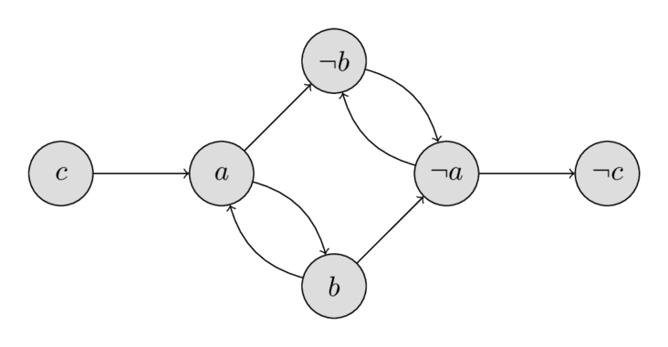
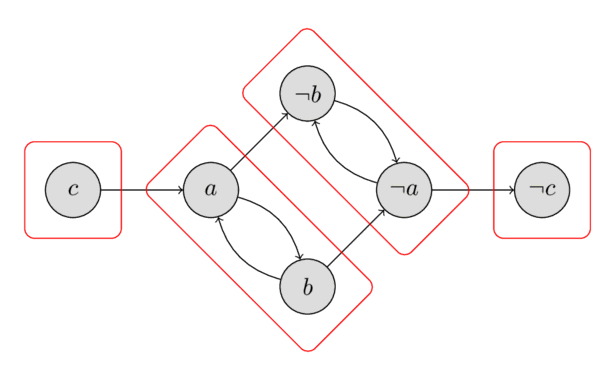

# 2-SAT

---
tags:
  - Dịch
e_maxx_link: 2_sat
---

# 2-SAT

SAT (bài toán thỏa mãn Boolean) là bài toán gán các giá trị Boolean cho các biến để thỏa mãn một công thức Boolean nhất định.
Công thức Boolean thường sẽ được đưa ra ở dạng CNF (dạng chuẩn kết hợp), là sự kết hợp của nhiều mệnh đề, trong đó mỗi mệnh đề là một sự phân tách (disjunction) các _literal_ (biến hoặc phủ định của biến).
2-SAT (2-thỏa mãn) là một hạn chế của bài toán SAT, trong 2-SAT, mọi mệnh đề đều có chính xác hai _literal_.
Đây là một ví dụ về bài toán 2-SAT như vậy.
Tìm một phép gán của $a, b, c$ sao cho công thức sau là đúng:

$$(a \lor \lnot b) \land (\lnot a \lor b) \land (\lnot a \lor \lnot b) \land (a \lor \lnot c)$$

SAT là NP-đầy đủ, không có giải pháp hiệu quả nào được biết đến cho nó.
Tuy nhiên, 2SAT có thể được giải quyết một cách hiệu quả trong $O(n + m)$, trong đó $n$ là số lượng biến và $m$ là số lượng mệnh đề.

## Thuật toán:

Đầu tiên, chúng ta cần chuyển đổi bài toán sang một dạng khác, cái gọi là dạng chuẩn hàm ý (implicative normal form).
Lưu ý rằng biểu thức $a \lor b$ tương đương với $\lnot a \Rightarrow b \land \lnot b \Rightarrow a$ (nếu một trong hai biến là sai, thì biến còn lại phải là đúng).

Bây giờ chúng ta xây dựng một đồ thị có hướng của các hàm ý này:
đối với mỗi biến $x$, sẽ có hai đỉnh $v_x$ và $v_{\lnot x}$.
Các cạnh sẽ tương ứng với các hàm ý.

Hãy xem ví dụ ở dạng 2-CNF:

$$(a \lor \lnot b) \land (\lnot a \lor b) \land (\lnot a \lor \lnot b) \land (a \lor \lnot c)$$

Đồ thị có hướng sẽ chứa các đỉnh và cạnh sau:

$$\begin{array}{cccc}
\lnot a \Rightarrow \lnot b & a \Rightarrow b & a \Rightarrow \lnot b & \lnot a \Rightarrow \lnot c\\
b \Rightarrow a & \lnot b \Rightarrow \lnot a & b \Rightarrow \lnot a & c \Rightarrow a
\end{array}$$

Bạn có thể thấy đồ thị hàm ý trong hình ảnh sau:

<center></center>

Điều đáng chú ý là thuộc tính của đồ thị hàm ý:
nếu có một cạnh $a \Rightarrow b$, thì cũng có một cạnh $\lnot b \Rightarrow \lnot a$.

Cũng lưu ý rằng, nếu $x$ có thể truy cập được từ $\lnot x$ và $\lnot x$ có thể truy cập được từ $x$, thì bài toán không có giải pháp.
Bất kể giá trị nào chúng ta chọn cho biến $x$, nó sẽ luôn dẫn đến mâu thuẫn - nếu $x$ được gán là $\text{true}$ thì hàm ý cho chúng ta biết rằng $\lnot x$ cũng phải là $\text{true}$ và ngược lại.
Hóa ra, điều kiện này không chỉ là cần thiết mà còn là đủ.
Chúng ta sẽ chứng minh điều này trong một vài đoạn bên dưới.
Trước tiên, hãy nhớ lại, nếu một đỉnh có thể truy cập được từ đỉnh thứ hai và đỉnh thứ hai có thể truy cập được từ đỉnh thứ nhất, thì hai đỉnh này nằm trong cùng một thành phần được kết nối mạnh (strongly connected component).
Do đó, chúng ta có thể hình thành tiêu chí cho sự tồn tại của một giải pháp như sau:

Để bài toán 2-SAT này có giải pháp, điều kiện cần và đủ là đối với bất kỳ biến $x$ nào, các đỉnh $x$ và $\lnot x$ nằm trong các thành phần được kết nối mạnh khác nhau của kết nối mạnh của đồ thị hàm ý.

Tiêu chí này có thể được xác minh trong thời gian $O(n + m)$ bằng cách tìm tất cả các thành phần được kết nối mạnh.

Hình ảnh sau đây cho thấy tất cả các thành phần được kết nối mạnh cho ví dụ.
Như chúng ta có thể dễ dàng kiểm tra, không có thành phần nào trong bốn thành phần chứa đỉnh $x$ và phủ định của nó $\lnot x$, do đó ví dụ có một giải pháp.
Chúng ta sẽ tìm hiểu trong các đoạn tiếp theo cách tính toán một phép gán hợp lệ, nhưng chỉ cho mục đích trình diễn, giải pháp $a = \text{false}$, $b = \text{false}$, $c = \text{false}$ được đưa ra.

<center></center>

Bây giờ chúng ta xây dựng thuật toán để tìm giải pháp của bài toán 2-SAT với giả định rằng giải pháp tồn tại.

Lưu ý rằng, mặc dù thực tế là giải pháp tồn tại, nhưng có thể xảy ra trường hợp $\lnot x$ có thể truy cập được từ $x$ trong đồ thị hàm ý, hoặc (nhưng không đồng thời) $x$ có thể truy cập được từ $\lnot x$.
Trong trường hợp đó, việc lựa chọn $\text{true}$ hoặc $\text{false}$ cho $x$ sẽ dẫn đến mâu thuẫn, trong khi việc lựa chọn cái còn lại sẽ không.
Hãy tìm hiểu cách chọn một giá trị, sao cho chúng ta không tạo ra mâu thuẫn.

Chúng ta hãy sắp xếp các thành phần được kết nối mạnh theo thứ tự topo (tức là $\text{comp}[v] \le \text{comp}[u]$ nếu có đường dẫn từ $v$ đến $u$) và cho $\text{comp}[v]$ biểu thị chỉ số của thành phần được kết nối mạnh mà đỉnh $v$ thuộc về.
Sau đó, nếu $\text{comp}[x] < \text{comp}[\lnot x]$, chúng ta gán $x$ với $\text{false}$ và $\text{true}$ trong trường hợp ngược lại.

Chúng ta hãy chứng minh rằng với phép gán này của các biến, chúng ta không đi đến mâu thuẫn.
Giả sử $x$ được gán với $\text{true}$.
Trường hợp khác có thể được chứng minh theo cách tương tự.

Đầu tiên, chúng ta chứng minh rằng đỉnh $x$ không thể đạt đến đỉnh $\lnot x$.
Bởi vì chúng ta đã gán $\text{true}$, nó phải giữ rằng chỉ số của thành phần được kết nối mạnh của $x$ lớn hơn chỉ số của thành phần của $\lnot x$.
Điều này có nghĩa là $\lnot x$ nằm ở bên trái của thành phần chứa $x$, và đỉnh sau không thể đạt đến đỉnh đầu tiên.

Thứ hai, chúng ta chứng minh rằng không tồn tại biến $y$ sao cho cả hai đỉnh $y$ và $\lnot y$ đều có thể truy cập được từ $x$ trong đồ thị hàm ý.
Điều này sẽ gây ra mâu thuẫn, bởi vì $x = \text{true}$ ngụ ý rằng $y = \text{true}$ và $\lnot y = \text{true}$.
Chúng ta hãy chứng minh điều này bằng phản chứng.
Giả sử rằng cả $y$ và $\lnot y$ đều có thể truy cập được từ $x$, thì theo thuộc tính của đồ thị hàm ý, $\lnot x$ có thể truy cập được từ cả $y$ và $\lnot y$.
Theo tính chất bắc cầu, kết quả này là $\lnot x$ có thể truy cập được bằng $x$, điều này mâu thuẫn với giả định.

Vì vậy, chúng ta đã xây dựng một thuật toán tìm các giá trị cần thiết của các biến với giả định rằng đối với bất kỳ biến $x$ nào, các đỉnh $x$ và $\lnot x$ nằm trong các thành phần được kết nối mạnh khác nhau.
Ở trên đã cho thấy tính đúng đắn của thuật toán này.
Do đó, chúng ta đồng thời chứng minh tiêu chí trên cho sự tồn tại của một giải pháp.

## Triển khai:

Bây giờ chúng ta có thể triển khai toàn bộ thuật toán.
Đầu tiên, chúng ta xây dựng đồ thị hàm ý và tìm tất cả các thành phần được kết nối mạnh.
Điều này có thể được thực hiện bằng thuật toán Kosaraju trong thời gian $O(n + m)$.
Trong lần duyệt thứ hai của đồ thị, thuật toán Kosaraju truy cập các thành phần được kết nối mạnh theo thứ tự topo, do đó rất dễ dàng để tính toán $\text{comp}[v]$ cho mỗi đỉnh $v$.

Sau đó, chúng ta có thể chọn phép gán của $x$ bằng cách so sánh $\text{comp}[x]$ và $\text{comp}[\lnot x]$.
Nếu $\text{comp}[x] = \text{comp}[\lnot x]$ thì chúng ta trả về $\text{false}$ để chỉ ra rằng không tồn tại phép gán hợp lệ nào thỏa mãn bài toán 2-SAT.

Dưới đây là cách triển khai giải pháp của bài toán 2-SAT cho đồ thị hàm ý $adj$ đã được xây dựng và đồ thị chuyển vị $adj^{\intercal}$ (trong đó hướng của mỗi cạnh bị đảo ngược).
Trong đồ thị, các đỉnh có chỉ số $2k$ và $2k+1$ là hai đỉnh tương ứng với biến $k$ với $2k+1$ tương ứng với biến bị phủ định.

```{.cpp file=2sat}
struct TwoSatSolver {
    int n_vars;
    int n_vertices;
    vector<vector<int>> adj, adj_t;
    vector<bool> used;
    vector<int> order, comp;
    vector<bool> assignment;

    TwoSatSolver(int _n_vars) : n_vars(_n_vars), n_vertices(2 * n_vars), adj(n_vertices), adj_t(n_vertices), used(n_vertices), order(), comp(n_vertices, -1), assignment(n_vars) {
        order.reserve(n_vertices);
    }
    void dfs1(int v) {
        used[v] = true;
        for (int u : adj[v]) {
            if (!used[u])
                dfs1(u);
        }
        order.push_back(v);
    }

    void dfs2(int v, int cl) {
        comp[v] = cl;
        for (int u : adj_t[v]) {
            if (comp[u] == -1)
                dfs2(u, cl);
        }
    }

    bool solve_2SAT() {
        order.clear();
        used.assign(n_vertices, false);
        for (int i = 0; i < n_vertices; ++i) {
            if (!used[i])
                dfs1(i);
        }

        comp.assign(n_vertices, -1);
        for (int i = 0, j = 0; i < n_vertices; ++i) {
            int v = order[n_vertices - i - 1];
            if (comp[v] == -1)
                dfs2(v, j++);
        }

        assignment.assign(n_vars, false);
        for (int i = 0; i < n_vertices; i += 2) {
            if (comp[i] == comp[i + 1])
                return false;
            assignment[i / 2] = comp[i] > comp[i + 1];
        }
        return true;
    }

    void add_disjunction(int a, bool na, int b, bool nb) {
        // na và nb biểu thị liệu a và b có bị phủ định hay không
        a = 2 * a ^ na;
        b = 2 * b ^ nb;
        int neg_a = a ^ 1;
        int neg_b = b ^ 1;
        adj[neg_a].push_back(b);
        adj[neg_b].push_back(a);
        adj_t[b].push_back(neg_a);
        adj_t[a].push_back(neg_b);
    }

    static void example_usage() {
        TwoSatSolver solver(3); // a, b, c
        solver.add_disjunction(0, false, 1, true);  //     a  v  not b
        solver.add_disjunction(0, true, 1, true);   // not a  v  not b
        solver.add_disjunction(1, false, 2, false); //     b  v      c
        solver.add_disjunction(0, false, 0, false); //     a  v      a
        assert(solver.solve_2SAT() == true);
        auto expected = vector<bool>{{true, false, true}};
        assert(solver.assignment == expected);
    }
};
```

## Bài tập thực hành
 * [Codeforces: The Door Problem](http://codeforces.com/contest/776/problem/D)
 * [Kattis: Illumination](https://open.kattis.com/problems/illumination)
 * [UVA: Rectangles](https://uva.onlinejudge.org/index.php?option=com_onlinejudge&Itemid=8&page=show_problem&problem=3081)
 * [Codeforces: Radio Stations](https://codeforces.com/problemset/problem/1215/F)
 * [CSES: Giant Pizza](https://cses.fi/problemset/task/1684)
 * [Codeforces: +-1](https://codeforces.com/contest/1971/problem/H)

--- 


