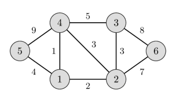
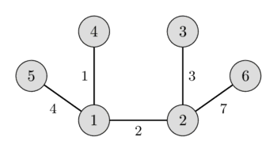

---
tags:
  - Translated
e_maxx_link: mst_kruskal
---

# Cây khung nhỏ nhất - Thuật toán Kruskal

Cho một đồ thị vô hướng có trọng số.
Chúng ta muốn tìm một cây con của đồ thị này kết nối tất cả các đỉnh (tức là nó là một cây khung) và có trọng số nhỏ nhất (tức là tổng trọng số của tất cả các cạnh là nhỏ nhất) trong số tất cả các cây khung có thể.
Cây khung này được gọi là cây khung nhỏ nhất.

Trong hình bên trái, bạn có thể thấy một đồ thị vô hướng có trọng số, và trong hình bên phải, bạn có thể thấy cây khung nhỏ nhất tương ứng.

 

Bài viết này sẽ thảo luận về một số sự thật quan trọng liên quan đến cây khung nhỏ nhất, và sau đó sẽ đưa ra cách triển khai đơn giản nhất của thuật toán Kruskal để tìm cây khung nhỏ nhất.

## Thuộc tính của cây khung nhỏ nhất

* Cây khung nhỏ nhất của một đồ thị là duy nhất, nếu trọng số của tất cả các cạnh là khác biệt. Nếu không, có thể có nhiều cây khung nhỏ nhất.
  (Các thuật toán cụ thể thường xuất ra một trong các cây khung nhỏ nhất có thể).
* Cây khung nhỏ nhất cũng là cây có tích trọng số của các cạnh là nhỏ nhất.
  (Điều này có thể được chứng minh dễ dàng bằng cách thay thế trọng số của tất cả các cạnh bằng logarit của chúng)
* Trong một cây khung nhỏ nhất của một đồ thị, trọng số lớn nhất của một cạnh là nhỏ nhất có thể từ tất cả các cây khung có thể của đồ thị đó.
  (Điều này xuất phát từ tính hợp lệ của thuật toán Kruskal).
* Cây khung lớn nhất (cây khung có tổng trọng số của các cạnh là lớn nhất) của một đồ thị có thể được thu được tương tự như cây khung nhỏ nhất, bằng cách thay đổi dấu của trọng số của tất cả các cạnh thành ngược lại và sau đó áp dụng bất kỳ thuật toán cây khung nhỏ nhất nào.

## Thuật toán Kruskal

Thuật toán này được mô tả bởi Joseph Bernard Kruskal, Jr. vào năm 1956.

Thuật toán Kruskal ban đầu đặt tất cả các nút của đồ thị ban đầu cách ly với nhau, để tạo thành một rừng cây nút đơn, và sau đó dần dần hợp nhất các cây này, kết hợp tại mỗi lần lặp bất kỳ hai trong số tất cả các cây với một số cạnh của đồ thị ban đầu. Trước khi thực hiện thuật toán, tất cả các cạnh được sắp xếp theo trọng số (theo thứ tự không giảm dần). Sau đó bắt đầu quá trình hợp nhất: chọn tất cả các cạnh từ đầu đến cuối (theo thứ tự đã sắp xếp), và nếu các đầu của cạnh được chọn hiện tại thuộc về các cây con khác nhau, các cây con này được kết hợp và cạnh được thêm vào câu trả lời. Sau khi lặp qua tất cả các cạnh, tất cả các đỉnh sẽ thuộc về cùng một cây con và chúng ta sẽ nhận được câu trả lời.

## Triển khai đơn giản nhất

Mã sau đây trực tiếp triển khai thuật toán được mô tả ở trên và có độ phức tạp thời gian là $O(M \log M + N^2)$.
Việc sắp xếp các cạnh yêu cầu $O(M \log N)$ (giống như $O(M \log M)$) thao tác.
Thông tin liên quan đến cây con mà một đỉnh thuộc về được duy trì với sự trợ giúp của một mảng `tree_id[]` - đối với mỗi đỉnh `v`, `tree_id[v]` lưu trữ số của cây mà `v` thuộc về.
Đối với mỗi cạnh, liệu nó có thuộc về các đầu của các cây khác nhau hay không, có thể được xác định trong $O(1)$.
Cuối cùng, việc hợp nhất hai cây được thực hiện trong $O(N)$ bằng một lần duyệt đơn giản qua mảng `tree_id[]`.
Cho rằng tổng số thao tác hợp nhất là $N-1$, chúng ta thu được hành vi tiệm cận của $O(M \log N + N^2)$.

```cpp
struct Edge {
    int u, v, weight;
    bool operator<(Edge const& other) {
        return weight < other.weight;
    }
};

int n;
vector<Edge> edges;

int cost = 0;
vector<int> tree_id(n);
vector<Edge> result;
for (int i = 0; i < n; i++)
    tree_id[i] = i;

sort(edges.begin(), edges.end());
   
for (Edge e : edges) {
    if (tree_id[e.u] != tree_id[e.v]) {
        cost += e.weight;
        result.push_back(e);

        int old_id = tree_id[e.u], new_id = tree_id[e.v];
        for (int i = 0; i < n; i++) {
            if (tree_id[i] == old_id)
                tree_id[i] = new_id;
        }
    }
}
```

## Chứng minh tính đúng đắn

Tại sao thuật toán Kruskal lại cho chúng ta kết quả chính xác?

Nếu đồ thị ban đầu được kết nối, thì đồ thị kết quả cũng sẽ được kết nối.
Bởi vì nếu không sẽ có hai thành phần có thể được kết nối với ít nhất một cạnh. Điều này là không thể, bởi vì Kruskal sẽ chọn một trong những cạnh này, vì id của các thành phần là khác nhau.
Ngoài ra, đồ thị kết quả không chứa bất kỳ chu trình nào, vì chúng tôi cấm điều này một cách rõ ràng trong thuật toán.
Do đó, thuật toán tạo ra một cây khung.

Vậy tại sao thuật toán này lại cho chúng ta một cây khung nhỏ nhất?

Chúng ta có thể chỉ ra đề xuất "nếu $F$ là một tập hợp các cạnh được chọn bởi thuật toán tại bất kỳ giai đoạn nào trong thuật toán, thì tồn tại một MST chứa tất cả các cạnh của $F$" bằng cách sử dụng quy nạp.

Đề xuất rõ ràng là đúng lúc ban đầu, tập hợp rỗng là một tập con của bất kỳ MST nào.

Bây giờ, giả sử $F$ là một tập hợp cạnh nào đó tại bất kỳ giai đoạn nào của thuật toán, $T$ là một MST chứa $F$ và $e$ là cạnh mới mà chúng ta muốn thêm bằng Kruskal.

Nếu $e$ tạo ra một chu trình, thì chúng ta không thêm nó, và do đó đề xuất vẫn đúng sau bước này.

Trong trường hợp $T$ đã chứa $e$, đề xuất cũng đúng sau bước này.

Trong trường hợp $T$ không chứa cạnh $e$, thì $T + e$ sẽ chứa một chu trình $C$.
Chu trình này sẽ chứa ít nhất một cạnh $f$, không nằm trong $F$.
Tập hợp các cạnh $T - f + e$ cũng sẽ là một cây khung.
Lưu ý rằng trọng số của $f$ không thể nhỏ hơn trọng số của $e$, bởi vì nếu không Kruskal sẽ chọn $f$ trước đó.
Nó cũng không thể có trọng số lớn hơn, vì điều đó sẽ làm cho tổng trọng số của $T - f + e$ nhỏ hơn tổng trọng số của $T$, điều này là không thể vì $T$ đã là một MST.
Điều này có nghĩa là trọng số của $e$ phải bằng với trọng số của $f$.
Do đó, $T - f + e$ cũng là một MST và nó chứa tất cả các cạnh từ $F + e$.
Vì vậy, ở đây đề xuất vẫn được thực hiện sau bước này.

Điều này chứng minh đề xuất.
Điều này có nghĩa là sau khi lặp qua tất cả các cạnh, tập hợp cạnh kết quả sẽ được kết nối và sẽ được chứa trong một MST, điều này có nghĩa là nó phải là một MST.

## Triển khai cải tiến

Chúng ta có thể sử dụng cấu trúc dữ liệu [**Disjoint Set Union** (DSU)](../data_structures/disjoint_set_union.md) để viết một triển khai nhanh hơn của thuật toán Kruskal với độ phức tạp thời gian khoảng $O(M \log N)$. [Bài viết này](mst_kruskal_with_dsu.md) trình bày chi tiết cách tiếp cận như vậy.

## Bài tập thực hành

* [SPOJ - Koicost](http://www.spoj.com/problems/KOICOST/)
* [SPOJ - MaryBMW](http://www.spoj.com/problems/MARYBMW/)
* [Codechef - Fullmetal Alchemist](https://www.codechef.com/ICL2016/problems/ICL16A)
* [Codeforces - Edges in MST](http://codeforces.com/contest/160/problem/D)
* [UVA 12176 - Bring Your Own Horse](https://uva.onlinejudge.org/index.php?option=com_onlinejudge&Itemid=8&page=show_problem&problem=3328)
* [UVA 10600 - ACM Contest and Blackout](https://uva.onlinejudge.org/index.php?option=com_onlinejudge&Itemid=8&page=show_problem&problem=1541)
* [UVA 10724 - Road Construction](https://uva.onlinejudge.org/index.php?option=onlinejudge&page=show_problem&problem=1665)
* [Hackerrank - Roads in HackerLand](https://www.hackerrank.com/contests/june-world-codesprint/challenges/johnland/problem)
* [UVA 11710 - Expensive subway](https://uva.onlinejudge.org/index.php?option=com_onlinejudge&Itemid=8&page=show_problem&problem=2757)
* [Codechef - Chefland and Electricity](https://www.codechef.com/problems/CHEFELEC)
* [UVA 10307 - Killing Aliens in Borg Maze](https://uva.onlinejudge.org/index.php?option=com_onlinejudge&Itemid=8&page=show_problem&problem=1248)
* [Codeforces - Flea](http://codeforces.com/problemset/problem/32/C)
* [Codeforces - Igon in Museum](http://codeforces.com/problemset/problem/598/D)
* [Codeforces - Hongcow Builds a Nation](http://codeforces.com/problemset/problem/744/A)
* [UVA - 908 - Re-connecting Computer Sites](https://uva.onlinejudge.org/index.php?option=com_onlinejudge&Itemid=8&page=show_problem&problem=849)
* [UVA 1208 - Oreon](https://uva.onlinejudge.org/index.php?option=com_onlinejudge&Itemid=8&page=show_problem&problem=3649)
* [UVA 1235 - Anti Brute Force Lock](https://uva.onlinejudge.org/index.php?option=com_onlinejudge&Itemid=8&page=show_problem&problem=3676)
* [UVA 10034 - Freckles](https://uva.onlinejudge.org/index.php?option=com_onlinejudge&Itemid=8&page=show_problem&problem=975)
* [UVA 11228 - Transportation system](https://uva.onlinejudge.org/index.php?option=onlinejudge&page=show_problem&problem=2169)
* [UVA 11631 - Dark roads](https://uva.onlinejudge.org/index.php?option=com_onlinejudge&Itemid=8&page=show_problem&problem=2678)
* [UVA 11733 - Airports](https://uva.onlinejudge.org/index.php?option=com_onlinejudge&Itemid=8&page=show_problem&problem=2833)
* [UVA 11747 - Heavy Cycle Edges](https://uva.onlinejudge.org/index.php?option=com_onlinejudge&Itemid=8&page=show_problem&problem=2847)
* [SPOJ - Blinet](http://www.spoj.com/problems/BLINNET/)
* [SPOJ - Help the Old King](http://www.spoj.com/problems/IITKWPCG/)
* [Codeforces - Hierarchy](http://codeforces.com/contest/17/problem/B)
* [SPOJ - Modems](https://www.spoj.com/problems/EC_MODE/)
* [CSES - Road Reparation](https://cses.fi/problemset/task/1675)
* [CSES - Road Construction](https://cses.fi/problemset/task/1676)
