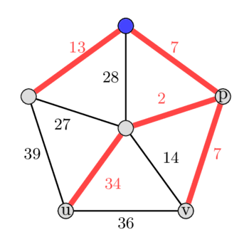
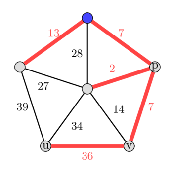

---
tags:
  - Original
---

# Cây khung nhỏ nhất tốt thứ hai

Cây khung nhỏ nhất $T$ là một cây cho đồ thị $G$ cho trước, trải dài trên tất cả các đỉnh của đồ thị cho trước và có tổng trọng số nhỏ nhất của tất cả các cạnh, từ tất cả các cây khung có thể.
Cây khung nhỏ nhất tốt thứ hai $T'$ là một cây khung, có tổng trọng số nhỏ thứ hai của tất cả các cạnh, từ tất cả các cây khung có thể của đồ thị $G$.

## Quan sát

Giả sử $T$ là Cây khung nhỏ nhất của đồ thị $G$.
Có thể quan sát thấy rằng Cây khung nhỏ nhất tốt thứ hai khác với $T$ chỉ bằng việc thay thế một cạnh. (Để biết bằng chứng về tuyên bố này, hãy tham khảo bài toán 23-1 [tại đây](http://www-bcf.usc.edu/~shanghua/teaching/Spring2010/public_html/files/HW2_Solutions_A.pdf)).

Vì vậy, chúng ta cần tìm một cạnh $e_{new}$ không nằm trong $T$, và thay thế nó bằng một cạnh trong $T$ (giả sử là $e_{old}$) sao cho đồ thị mới $T' = (T \cup \{e_{new}\}) \setminus \{e_{old}\}$ là một cây khung và hiệu số trọng số ($e_{new} - e_{old}$) là nhỏ nhất.


## Sử dụng thuật toán Kruskal

Chúng ta có thể sử dụng thuật toán Kruskal để tìm MST trước, và sau đó chỉ cần thử loại bỏ một cạnh duy nhất khỏi nó và thay thế nó bằng một cạnh khác.

1. Sắp xếp các cạnh trong $O(E \log E)$, sau đó tìm MST bằng Kruskal trong $O(E)$.
2. Đối với mỗi cạnh trong MST (chúng ta sẽ có $V-1$ cạnh trong đó) tạm thời loại trừ nó khỏi danh sách cạnh để nó không thể được chọn.
3. Sau đó, một lần nữa thử tìm MST trong $O(E)$ bằng cách sử dụng các cạnh còn lại.
4. Thực hiện việc này cho tất cả các cạnh trong MST và lấy kết quả tốt nhất trong số đó.

Lưu ý: chúng ta không cần phải sắp xếp lại các cạnh trong Bước 3.

Vì vậy, độ phức tạp thời gian tổng thể sẽ là $O(E \log V + E + V E)$ = $O(V E)$.


## Mô hình hóa thành bài toán Tổ tiên chung thấp nhất (LCA)

Trong cách tiếp cận trước, chúng ta đã thử tất cả các khả năng loại bỏ một cạnh của MST.
Ở đây chúng ta sẽ làm điều ngược lại.
Chúng ta cố gắng thêm mọi cạnh chưa có trong MST.

1. Sắp xếp các cạnh trong $O(E \log E)$, sau đó tìm MST bằng Kruskal trong $O(E)$.
2. Đối với mỗi cạnh $e$ chưa có trong MST, hãy tạm thời thêm nó vào MST, tạo ra một chu trình. Chu trình sẽ đi qua LCA.
3. Tìm cạnh $k$ có trọng số lớn nhất trong chu trình không bằng $e$, bằng cách theo dõi các nút cha của cạnh $e$, cho đến LCA.
4. Loại bỏ $k$ tạm thời, tạo ra một cây khung mới.
5. Tính hiệu số trọng số $\delta = weight(e) - weight(k)$, và ghi nhớ nó cùng với cạnh đã thay đổi.
6. Lặp lại bước 2 cho tất cả các cạnh khác và trả về cây khung có hiệu số trọng số nhỏ nhất với MST.

Độ phức tạp thời gian của thuật toán phụ thuộc vào cách chúng ta tính toán các $k$, là các cạnh có trọng số tối đa trong bước 2 của thuật toán này.
Một cách để tính toán chúng một cách hiệu quả trong $O(E \log V)$ là biến đổi bài toán thành bài toán Tổ tiên chung thấp nhất (LCA).

Chúng ta sẽ tiền xử lý LCA bằng cách tạo gốc cho MST và cũng sẽ tính toán trọng số cạnh tối đa cho mỗi nút trên đường dẫn đến tổ tiên của chúng.
Điều này có thể được thực hiện bằng cách sử dụng [Binary Lifting](lca_binary_lifting.md) cho LCA.

Độ phức tạp thời gian cuối cùng của phương pháp này là $O(E \log V)$.

Ví dụ:

  <br>

*Trong hình bên trái là MST và bên phải là Cây khung nhỏ nhất tốt thứ hai.*


Trong đồ thị đã cho, giả sử chúng ta tạo gốc cho MST tại đỉnh màu xanh lam ở trên cùng, và sau đó chạy thuật toán của chúng ta bằng cách bắt đầu chọn các cạnh không có trong MST.
Giả sử cạnh được chọn đầu tiên là cạnh $(u, v)$ có trọng số 36.
Thêm cạnh này vào cây tạo thành một chu trình 36 - 7 - 2 - 34.

Bây giờ chúng ta sẽ tìm cạnh có trọng số lớn nhất trong chu trình này bằng cách tìm $\text{LCA}(u, v) = p$.
Chúng ta tính toán cạnh có trọng số tối đa trên đường dẫn từ $u$ đến $p$ và từ $v$ đến $p$.
Lưu ý: $\text{LCA}(u, v)$ cũng có thể bằng $u$ hoặc $v$ trong một số trường hợp.
Trong ví dụ này, chúng ta sẽ nhận được cạnh có trọng số 34 là trọng số cạnh tối đa trong chu trình.
Bằng cách loại bỏ cạnh, chúng ta nhận được một cây khung mới, có hiệu số trọng số chỉ là 2.

Sau khi thực hiện việc này với tất cả các cạnh khác không phải là một phần của MST ban đầu, chúng ta có thể thấy rằng cây khung này cũng là cây khung tốt thứ hai về tổng thể.
Chọn cạnh có trọng số 14 sẽ tăng trọng số của cây lên 7, chọn cạnh có trọng số 27 sẽ tăng nó lên 14, chọn cạnh có trọng số 28 sẽ tăng nó lên 21 và chọn cạnh có trọng số 39 sẽ tăng cây lên 5.

## Triển khai
```cpp
struct edge {
    int s, e, w, id;
    bool operator<(const struct edge& other) { return w < other.w; }
};
typedef struct edge Edge;

const int N = 2e5 + 5;
long long res = 0, ans = 1e18;
int n, m, a, b, w, id, l = 21;
vector<Edge> edges;
vector<int> h(N, 0), parent(N, -1), size(N, 0), present(N, 0);
vector<vector<pair<int, int>>> adj(N), dp(N, vector<pair<int, int>>(l));
vector<vector<int>> up(N, vector<int>(l, -1));

pair<int, int> combine(pair<int, int> a, pair<int, int> b) {
    vector<int> v = {a.first, a.second, b.first, b.second};
    int topTwo = -3, topOne = -2;
    for (int c : v) {
        if (c > topOne) {
            topTwo = topOne;
            topOne = c;
        } else if (c > topTwo && c < topOne) {
            topTwo = c;
        }
    }
    return {topOne, topTwo};
}

void dfs(int u, int par, int d) {
    h[u] = 1 + h[par];
    up[u][0] = par;
    dp[u][0] = {d, -1};
    for (auto v : adj[u]) {
        if (v.first != par) {
            dfs(v.first, u, v.second);
        }
    }
}

pair<int, int> lca(int u, int v) {
    pair<int, int> ans = {-2, -3};
    if (h[u] < h[v]) {
        swap(u, v);
    }
    for (int i = l - 1; i >= 0; i--) {
        if (h[u] - h[v] >= (1 << i)) {
            ans = combine(ans, dp[u][i]);
            u = up[u][i];
        }
    }
    if (u == v) {
        return ans;
    }
    for (int i = l - 1; i >= 0; i--) {
        if (up[u][i] != -1 && up[v][i] != -1 && up[u][i] != up[v][i]) {
            ans = combine(ans, combine(dp[u][i], dp[v][i]));
            u = up[u][i];
            v = up[v][i];
        }
    }
    ans = combine(ans, combine(dp[u][0], dp[v][0]));
    return ans;
}

int main(void) {
    cin >> n >> m;
    for (int i = 1; i <= n; i++) {
        parent[i] = i;
        size[i] = 1;
    }
    for (int i = 1; i <= m; i++) {
        cin >> a >> b >> w; // 1-indexed
        edges.push_back({a, b, w, i - 1});
    }
    sort(edges.begin(), edges.end());
    for (int i = 0; i <= m - 1; i++) {
        a = edges[i].s;
        b = edges[i].e;
        w = edges[i].w;
        id = edges[i].id;
        if (unite_set(a, b)) { 
            adj[a].emplace_back(b, w);
            adj[b].emplace_back(a, w);
            present[id] = 1;
            res += w;
        }
    }
    dfs(1, 0, 0);
    for (int i = 1; i <= l - 1; i++) {
        for (int j = 1; j <= n; ++j) {
            if (up[j][i - 1] != -1) {
                int v = up[j][i - 1];
                up[j][i] = up[v][i - 1];
                dp[j][i] = combine(dp[j][i - 1], dp[v][i - 1]);
            }
        }
    }
    for (int i = 0; i <= m - 1; i++) {
        id = edges[i].id;
        w = edges[i].w;
        if (!present[id]) {
            auto rem = lca(edges[i].s, edges[i].e);
            if (rem.first != w) {
                if (ans > res + w - rem.first) {
                    ans = res + w - rem.first;
                }
            } else if (rem.second != -1) {
                if (ans > res + w - rem.second) {
                    ans = res + w - rem.second;
                }
            }
        }
    }
    cout << ans << "\n";
    return 0;
}
```

## Tài liệu tham khảo

1. Competitive Programming-3, by Steven Halim
2. [web.mit.edu](http://web.mit.edu/6.263/www/quiz1-f05-sol.pdf)

## Bài tập
* [Codeforces - Cây khung nhỏ nhất cho mỗi cạnh](https://codeforces.com/problemset/problem/609/E)


